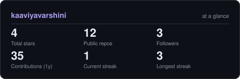

<!-- BANNER - terminal profile.sh --live (additive). Generated by scripts/banner/generate.py.
     Cache-bust with ?v=N after regenerating. -->
<picture>
  <source media="(prefers-color-scheme: dark)"  srcset="assets/banner-dark.v9.svg">
  <source media="(prefers-color-scheme: light)" srcset="assets/banner-light.v9.svg">
  
</picture>

 

<!-- NAME / TAGLINE - animated typing -->

 

<!-- SOCIALS — LinkedIn stays brand blue (glyph vanishes on custom fills). Others themed. -->
&nbsp;&nbsp;
&nbsp;&nbsp;

 

---

## This is me :)

Hi, I'm **Kaaviya**, an AI Engineer and Autonomous Systems Builder broadcasting from Chennai, India 🇮🇳.  
I architect multi-agent systems, intelligent RAG pipelines, and self-hosted AI security tools that bridge human intent and machine execution.

- 🎓 **SRM Institute of Science and Technology** — B.Tech CSE with AI Specialization (**CGPA: 9.88**).
- 🤖 **Multi-Agent Systems Architect** — Built **[Nexus Solo](https://github.com/kaaviyavarshini)**, replacing a 10-person agency with 5 autonomous AI agents (*Content, Trend, Crisis, Deal, Analytics*) using *Creator DNA* ML profiling across 10 Indian languages.
- 🛡️ **Autonomous Cyber Defense & Safety Systems** — Built **[Sentinel](https://github.com/kaaviyavarshini)** (self-hosted AI threat forensics with Gemma-3 and DBSCAN) and deterministic zero-blackout hospital controllers (**[MicroGrid Simulator](https://github.com/kaaviyavarshini/microgrid_simulation)**).
- 🔍 **Clinical & Enterprise GenAI** — Developed production RAG pipelines (**End-to-End Medical Chatbot** with LLaMA 2 & Pinecone) and natural language analytics (**Text-to-SQL Gemini App**).
- 🏆 **National Recognition** — **AWS AI For Bharat** (*Qualified for Prototype Round, 30+ states*), **Microsoft Imagine Cup '25**, and **Smart India Hackathon (SIH '25)**.
- 🌱 **My mission:** Building high-precision, resilient AI applications that solve critical real-world infrastructure, security, and automation challenges.
- 💬 Talk to me about **Agentic Workflows, LLM Orchestration, RAG Architectures & Cyber AI**!

 

## my perfect stack

---

## signals 

<table>
<tr>
<td width="50%" align="center" valign="middle">

<!-- Self-rated radar - edit assets/skills.json, the workflow redraws it -->
<picture>
  <source media="(prefers-color-scheme: dark)"  srcset="assets/radar-dark.svg">
  <source media="(prefers-color-scheme: light)" srcset="assets/radar-light.svg">
  
</picture>

</td>
<td width="50%" align="center" valign="middle">

<!-- Hand-authored contract & language stack radar - edit assets/langmix.json -->
<picture>
  <source media="(prefers-color-scheme: dark)"  srcset="assets/radar-langs-dark.svg">
  <source media="(prefers-color-scheme: light)" srcset="assets/radar-langs-light.svg">
  
</picture>

</td>
</tr>
</table>

---

## Numbers matter? ohhh yes. 

<!-- Generated by scripts/cards.py into this repo. Self-hosted SVG cards
     independent of third-party public instances. -->
<picture>
  <source media="(prefers-color-scheme: dark)"  srcset="assets/card-stats-dark.svg">
  <source media="(prefers-color-scheme: light)" srcset="assets/card-stats-light.svg">
  
</picture>

---

` Built with precision & passion · @kaaviyavarshini `

